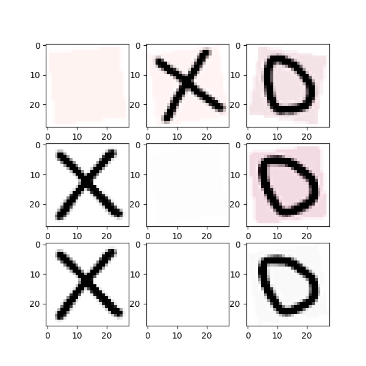

# TicTacToeDS
Tic Tac Toe dataset for use with DeepProblog

The repository contains the file TicTacToe.py 
where the dataset is defined in the format required 
by DeepProblog. The to_query() function generates 
the query *game(Board, Outcome)*, this part will have 
to be adapted to the logic program.

The dataset is generated in the following way:

1 - Reads the matches from CSV (data/labels/*.csv).

2 - Creates the boards, using synthetic images generated with inkscepe or using MNIST.

To use the dataset, run the command:
```
python run.py [--dataset]
```

to generate the synthetic dataset run the command:
```
cd data
python render.py [--size] 
```

Required:
- pytorch
- deepproblog
- PIL

The repository already contains .png files for 
the creation of synthetic images of size 150x150 
and 28x28. If you wish to create images of a different 
size, you will need to download inkscape.

Below is an example of a Board with MNIST and synthetic data. 
```
label: b,x,o,x,b,o,x,b,o
```


MNIST:
0 = b;
1 = o;
2 = x;



